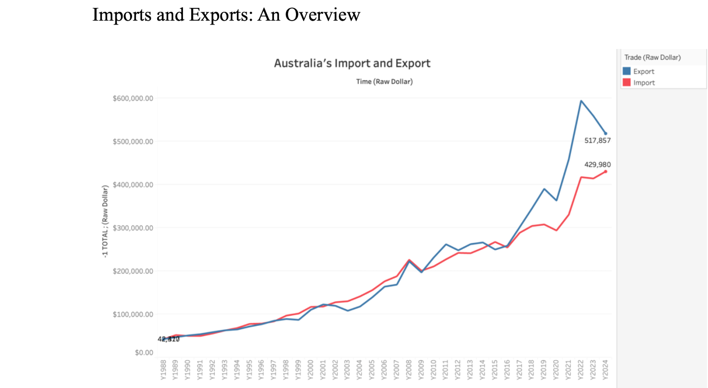
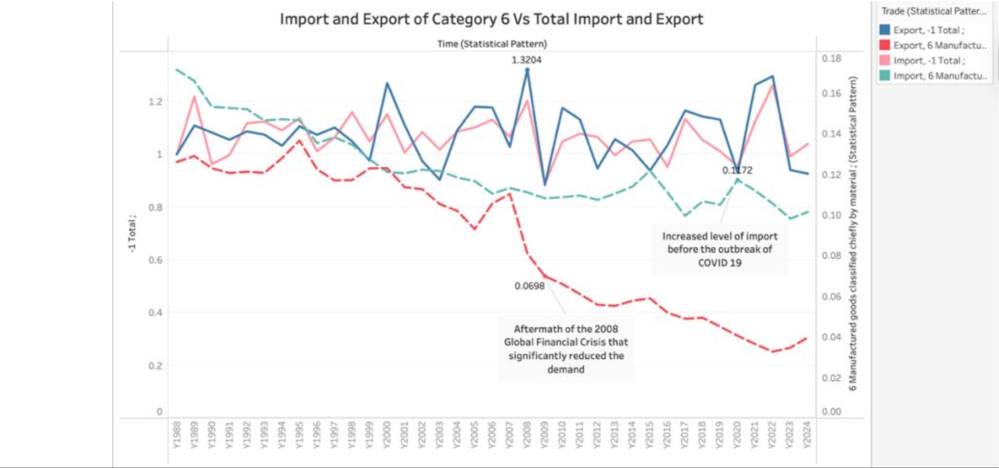
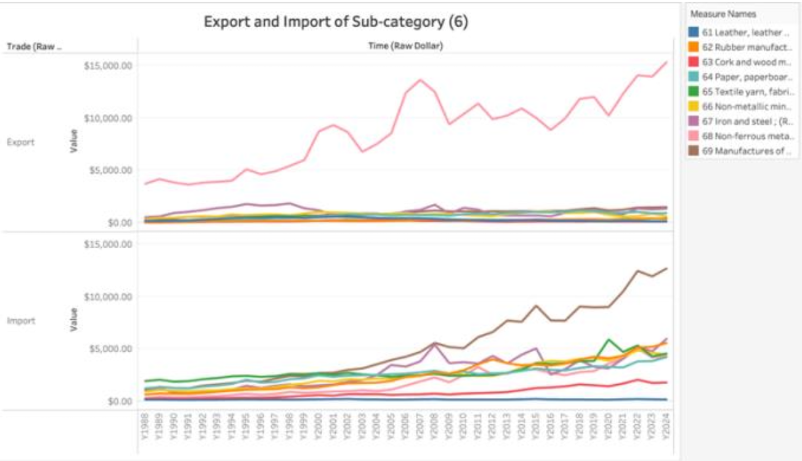
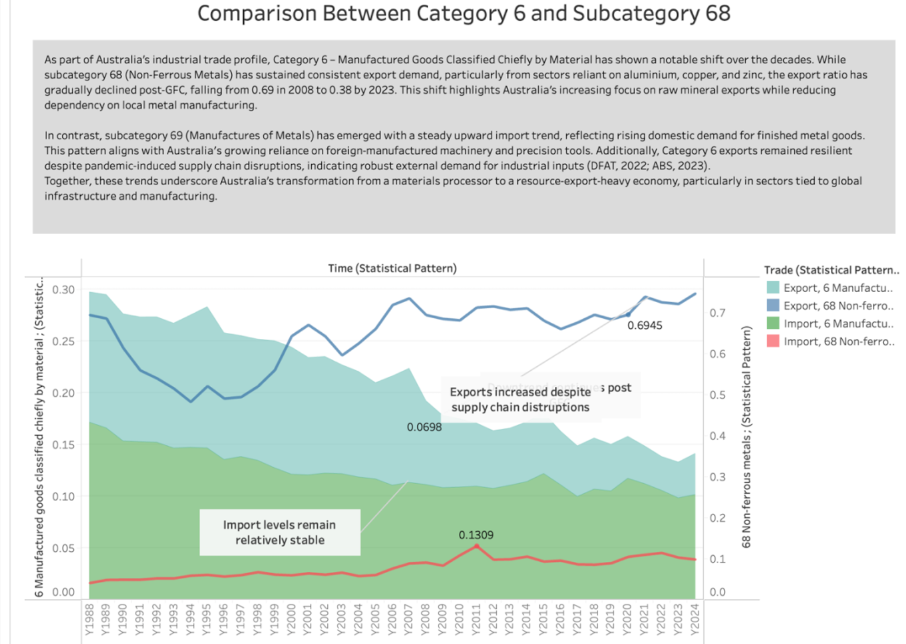
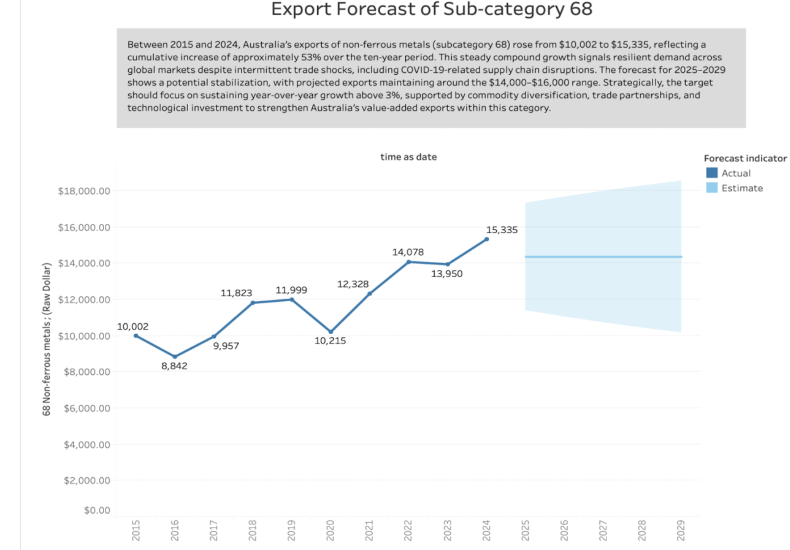

# Australia Import–Export Visual Analytics: Trade Patterns, Category Analysis & Export Forecasting

---

  
  
  
  
  


---

**Author:** Ali Abbas  
**Course:** Data Visualisation & Visual Analytics  
**Project Type:** Trade Data Analytics & Forecasting  
**Focus Area:** Australia Import–Export Trade (Category 6 & Subcategory 68)  
**Tools Used:** Excel, Tableau  
**Year:** 2025


---

## Project Summary

This project analyses Australia’s import and export trade patterns from **1988–2024**, focusing on **Category 6 – Manufactured Goods Classified Chiefly by Material** and key subcategories such as **Subcategory 68 (Non-Ferrous Metals)**.

Using Tableau dashboards, analytical storytelling, and forecasting techniques, the project identifies long-term structural trade trends, shifts in industrial demand, and future export projections.

**Business Value:**  
Supports strategic trade planning, industrial policy evaluation, and data-driven decision-making by highlighting historical behaviour, volatility, and future outlook.

---

## Key Objectives

- Analyse long-term import and export trends.
- Identify structural shifts and trade pattern changes.
- Compare Category 6 performance against major subcategories.
- Forecast export performance for Subcategory 68.
- Translate analytics into clear narrative storytelling.
- Present insights through professional data visualisations.

---

## Dataset

- **Source:** Australian Bureau of Statistics (ABS)
- **Time Period:** 1988–2024
- **Coverage:** Import & export values (Raw Dollar + Statistical Pattern)
- **Main Category:** Category 6 – Manufactured goods classified chiefly by material
- **Focus Subcategory:** 68 – Non-Ferrous Metals

---

## Methodology

### 1. Data Preparation & Transformation

- Combined import and export datasets into unified format.
- Created calculated fields for:
  - Raw dollar analysis
  - Statistical pattern ratios
  - Trend comparisons
- Performed cleaning, validation, and consistency checks.

### 2. Analytical Techniques

- Time-series trend analysis
- Comparative category vs subcategory analysis
- Ratio-based benchmarking
- Forecast estimation for export growth

### 3. Visualization & Storytelling

- Tableau dashboards for exploratory analysis.
- Storyboards for narrative-driven insights.
- Annotation layers highlighting major economic events.

---

## Key Insights

### Historical Trade Behaviour

- Category 6 exports showed resilience despite global disruptions.
- Subcategory 68 maintained steady export demand over decades.
- Import dependency increased for manufactured metal products.

### Structural Shift

- Export ratios declined post-Global Financial Crisis.
- Imports of manufactured metals rose steadily, indicating increased domestic demand.

### Forecast Outlook

- Subcategory 68 exports show stabilization with projected continuation in the **$14,000–$16,000 range**.
- Indicates maturity and reduced volatility compared to earlier growth cycles.

---

## Recommendations

1. Strengthen export infrastructure to support industrial sectors.
2. Diversify trade partnerships to reduce concentration risk.
3. Encourage value-added manufacturing capability.
4. Monitor global commodity cycles for proactive planning.

---

## Visualizations

### 1️⃣ Imports and Exports Overview



---

### 2️⃣ Category 6 Trade Analysis



---

### 3️⃣ Subcategory 6 Trends



---

### 4️⃣ Category 6 vs Subcategory 68 Comparison



---

### 5️⃣ Export Forecast – Subcategory 68



---

## Tools & Technologies

- **Visualization:** Tableau (Dashboards , Storyboards)
- **Data Processing:** Excel (cleaning, transformation, YoY calculations)
- **Analysis Techniques:** Descriptive analytics, trend ratios, forecasting

**Skills Demonstrated:**  
Data cleaning • Trade analytics • Forecasting • Business storytelling • Dashboard design • Report Writing 

---

## Conclusion

This project combines data analytics and storytelling to explain Australia’s evolving trade structure within manufactured goods. By integrating historical analysis with forecasting, it provides clear insights into industrial transformation and future export potential.

---

## Future Work

- Extend analysis to additional SITC categories.
- Apply predictive ML forecasting models.
- Build interactive Power BI dashboards.
- Integrate macroeconomic indicators for scenario modelling.

---

## Project Structure

```text
├── .gitignore
├── README.md
├── data/
│   ├── raw/
│   └── processed/
├── visuals/
│   ├── Total_Trade_Trends.png
│   ├── Category6_Trade_analysis.png
│   ├── 04_subcategory6_trends.png
│   ├── 05_Category6_vs_Subcategory68_Comparison.png
│   └── 06_Subcategory68_Export_Forecast.png
├── tableau/
│   └── trade_visual_analytics.twb
└── reports/
    └── Australia trade visual analytics.pdf


